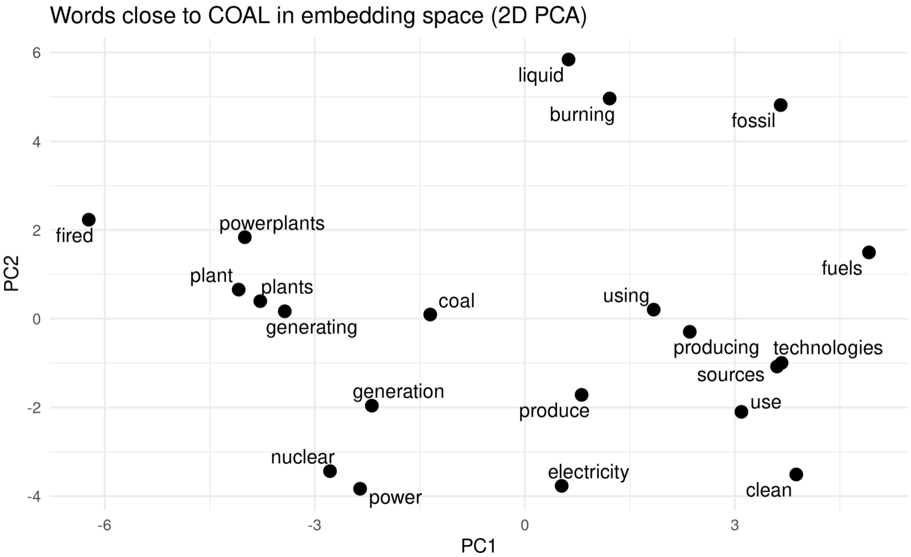
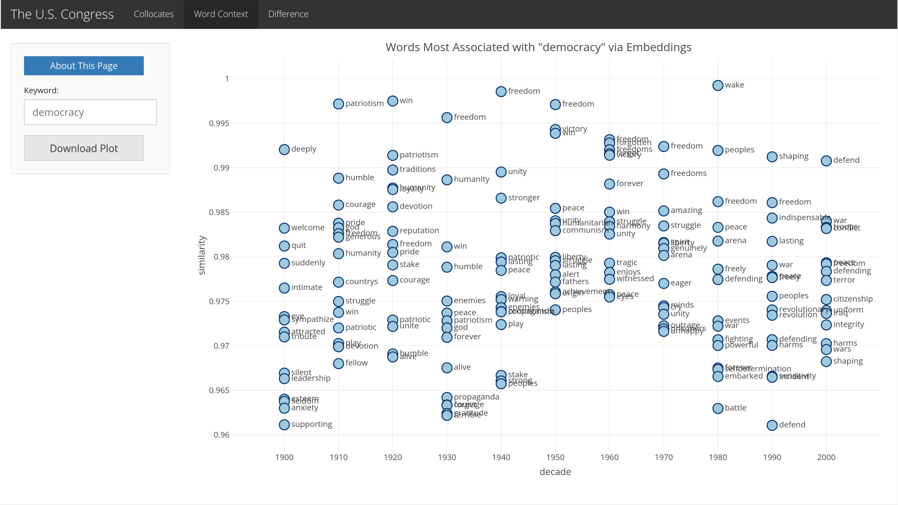
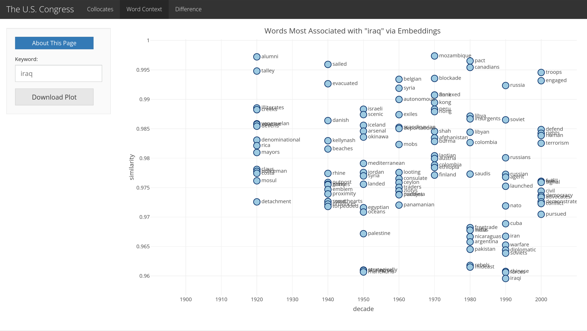
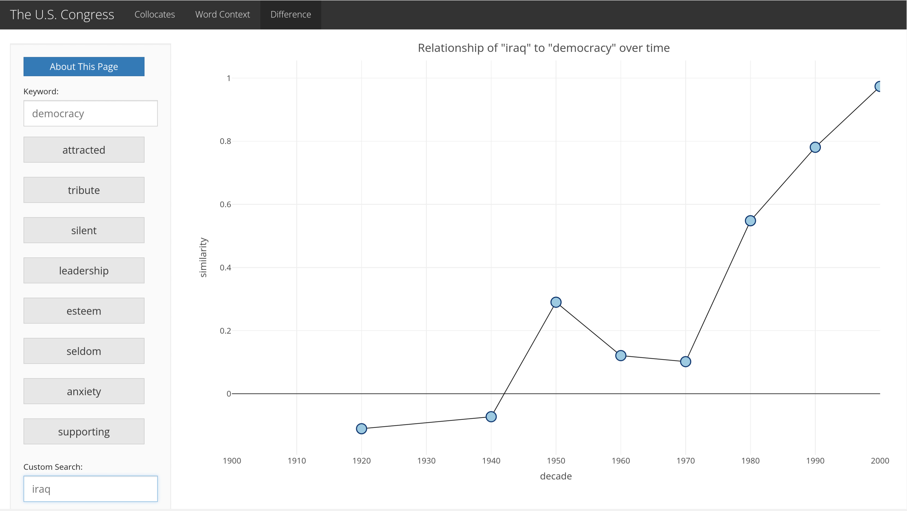

```{r setup, include=FALSE}
knitr::opts_chunk$set(echo = TRUE)
```

[Needs introduction]


We have been doing more "white box" analyses -- now a little "black box" analysis 

```{r, warning=FALSE, message=FALSE}
library(tmha.data)
library(text2vec)
library(tidyverse)
library(kableExtra)

data("congress_daily_climate_change_2000_2020")

congress_daily_climate_change_2000 <- congress_daily_climate_change_2000_2020 %>% 
  filter(decade == "2000")

climate_change_text_2000 <- congress_daily_climate_change_2000$content

congress_daily_climate_change_2010 <- congress_daily_climate_change_2000_2020 %>% 
  filter(decade == "2010")

climate_change_text_2010 <- congress_daily_climate_change_2000$content

congress_daily_climate_change_2020 <- congress_daily_climate_change_2000_2020 %>% 
  filter(decade == "2020")

climate_change_text_2020 <- congress_daily_climate_change_2020$content
```

## An Introduction to Word Embeddings

When a computer analyzes language, it cannot work with words directly. Instead, it represents each word as a list of numbers, called a vector. For example, instead of storing the word "climate" as text, the model might represent it like this:

> **climate → [0.21, -0.44, 0.88, 0.13, ...]**

Each number in the vector captures a small piece of the word's meaning based on how the word appears next to other words in the corpus. By examining these patterns across large amounts of text, it becomes possible for a computer to estimate the numeric representations that reflect relationships between words. To do this, we will use a technique called machine learning. 

Machine learning refers to computational methods that identify patterns in data and use those patterns to create numerical representations. These numerical represenations are improved through repeated calculations over the dataset. In this chapter, the specific machine learning approach used to represent words numerically is called word embeddings. 

Word embeddings represent each word as a point in a numeric space. Words that appear in similar contexts tend to be placed near one another in this space. Because the words are represented numerically, the distance between them can be measured, allowing analysts to identify which words are most closely associated with a given term. The following image of vector space flattened to a 2-dimensional visualization illustrates this idea. 

The word "fossil" appears closer to "fuels" than to "nuclear," and the word "nuclear" appears closer to "power." These associations are intuitive. Fossil fuels frequently appear together in discussions of energy production, whereas nuclear is often discussed as an alternative or contrasting form of energy. Because fossil fuels and nuclear power are frequently treated as separate concerns or appear in different contexts within policy debates—one associated with carbon emissions and the other with low-carbon energy—they tend to appear in different linguistic contexts, which places the words farther apart in space. Similar to the term "fossil fuels," nuclear is often described as "nuclear power," again making the close connection between the two words sensible.  

```{r, echo=FALSE}

```

Importantly, this 2-dimensional representation of the word embeddings is not a direct representation of the language inside the Congressional Records. The positions of the words reflect patterns of co-occurrence, not fixed meanings. Words appear close together because they are often used in similar contexts, not because they refer to the same concept. For example, nuclear may appear near coal because both are discussed in debates about electricity geeneration or energy policy, even though they represent different forms of energy.

It is also important to note that word embeddings capture statistical association within a specific dataset, not a definitive meaning behind words. In another corpus, like the 19th-century Hansard debates, the word "power" would not have co-occured with the word "nuclear," but perhaps instead alongside words that indicate political authority or the influence of the British Empire.  

In the following sections, we will create a word embedding model records from the United States Congressional Record that mention the word "climate." Rather than simply generating a word cloud, we will build functions that allow us to add and subtract word vectors and examine patterns of word association. Because our personal computers may have limited computing power, we will then use Congress Viewer, an application developed by one of the authors of this book, to analyze the Stanford Corpus of the Congressional Record at a much larger scale and to quickly test hypotheses about the language of the United States Congressional Records.

The following code demonstrates how to use the word embeddings model, GloVe. 

```{r}
# A function that trains GloVe word embeddings from a vector of text.
# The parameters control model size, context window, vocabulary filtering,
# training iterations, and reproducibility.
find_word_embeddings <- function(data,
                                 rank=50,
                                 window=5L,
                                 term_count_min=1,
                                 x_max=10,
                                 n_iter=30,
                                 seed=42) {
  
  # Tokenize the text: convert to lowercase and split sentences into words
  tokens <- word_tokenizer(str_to_lower(data))
  
  # Create an iterator over the tokenized text for efficient processing
  it <- itoken(tokens, ids = seq_along(tokens), progressbar = FALSE)
  
  # Build the vocabulary from the tokens and remove very rare words
  vocab <- create_vocabulary(it) %>%
    prune_vocabulary(term_count_min = term_count_min)
  
  # Convert the vocabulary into a vectorizer that maps words to indices
  vectorizer <- vocab_vectorizer(vocab)
  
  # Create a term–co-occurrence matrix showing which words appear near each other
  # within the specified window size
  tcm <- create_tcm(it, vectorizer, skip_grams_window = window)

  # Set the random seed so the results can be reproduced
  set.seed(seed)
  
  # Initialize the GloVe model with the chosen dimensionality and weighting parameter
  glove <- GlobalVectors$new(rank = rank, x_max = x_max)
  
  # Train the model on the co-occurrence matrix for the specified number of iterations
  wv_main <- glove$fit_transform(tcm, n_iter = n_iter)
  
  # Extract the context vectors learned during training
  wv_context <- glove$components
  
  # Combine the main and context vectors to produce the final word embeddings
  word_embeddings <- wv_main + t(wv_context)
}
```

```{r, echo=FALSE}
quiet_run <- function(expr) {
  tf <- tempfile()
  zz <- file(tf, open = "wt")
  on.exit({
    try(sink(type = "message"), silent = TRUE)
    try(sink(), silent = TRUE)
    close(zz)
    unlink(tf) }, add = TRUE)

  sink(zz)
  sink(zz, type = "message")
  force(expr) }

word_embeddings_2000 <- quiet_run(find_word_embeddings(climate_change_text_2000))
word_embeddings_2010 <- quiet_run(find_word_embeddings(climate_change_text_2010))
word_embeddings_2020 <- quiet_run(find_word_embeddings(climate_change_text_2020))
```

These settings control how the GloVe model learns relationships between words.

The rank determines how many numbers are used to represent each word. Representing words using more numbers allows the model to detect more subtle differences between words, while fewer numbers make the model simpler and faster but less precise.

The window (5) tells the model how many nearby words to pay attention to when learning meaning. The basic idea is that words that appear close together in sentences are often related, so the model looks at the five words on either side of each word.

The term_count_min (1) setting decides which words are included in the analysis. Words that appear fewer times than this threshold are ignored. This helps prevent extremely rare words, spelling mistakes, or noise in the data from influencing the model.

The x_max (10) setting reduces the influence of very common words. Words like “the,” “and,” or “of” appear so frequently that they could otherwise dominate the training process, so this parameter limits how much weight they receive.

The n_iter (30) parameter controls how many times the model goes through the data to refine its understanding of word relationships. More iterations usually improve the results, but they also make the process take longer.

Finally, the seed (42) ensures that the model produces the same results every time it runs with the same data and settings. This is important for reproducibility, especially in research.

GloVe prints short progress messages so it is possible to see how training is progressing. These messages include three pieces of information: the time, how many times the model has gone through the dataset (the epoch), and a number that indicates how well the model is learning (the loss value).

Model training happens iteratively. The term epoch refers to one complete pass through the entire dataset. This iteration is necessary because the model cannot capture the patterns in the data in a single pass. Instead, the training procedure gradually adjusts the model's parameters each time the data is processed. If the console shows epoch 10, it means the training process has gone through the entire corpus ten times, allowing the model to better capture statistical relationships between words.

The output also includes a loss value, which is a number that measures how well the model’s current predictions match the patterns observed in the data. During training, the model compares the relationships between words it predicts with the relationships that actually appear in the corpus. The loss value summarizes how different these two are. As training continues and the model’s parameters are updated, the loss typically becomes smaller, indicating that the predictions are aligning more closely with the patterns in the text.

During training, messages such as INFO [<timestamp>] epoch <k>, loss <value> appear in the console. These updates allow the user to watch the model’s progress as it repeatedly studies the corpus and gradually improves its understanding of relationships between words.

```{r, eval=FALSE}
word_embeddings_2000 <- find_word_embeddings(climate_change_text_2000)
word_embeddings_2010 <- find_word_embeddings(climate_change_text_2010)
word_embeddings_2020 <- find_word_embeddings(climate_change_text_2020)
```

## Finding Words with the Greatest Association

We can now write a function 

```{r}
get_similar <- function(keyword, word_embeddings, top_n = top_n_default) {
  
  kw_vec <- word_embeddings[keyword, , drop = FALSE]
  cos_sim <- sim2(word_embeddings, kw_vec, method = "cosine", norm = "l2")[, 1]

  tibble(word = names(cos_sim), similarity = unname(cos_sim)) %>%
    filter(word != keyword) %>%
    arrange(desc(similarity)) %>%
    slice_head(n = top_n) }
```

```{r}
most_similar_climate <- get_similar("climate", word_embeddings_2000, 10)
most_similar_emissions <- get_similar("emissions", word_embeddings_2000, 10)
most_similar_coal <- get_similar("coal", word_embeddings_2000, 20)
```


```{r}
tbl_2000 <- most_similar_climate %>%
  mutate(similarity = round(similarity, 3)) %>%
  kable(format = "latex",
    caption = 'Words Most Related to "Climate": 2000s Congressional Records',
        col.names = c("Word", "Cosine similarity"),
        align = c("l", "r"),
    booktabs = TRUE) %>%
  kable_styling(full_width = FALSE)

tbl_2000
```


```{r}
tbl_2010 <- most_similar_emissions %>%
  mutate(similarity = round(similarity, 3)) %>%
  kable(format = "latex", caption = 'Words Most Related to "Emissions": 2010s Congressional Records',
    col.names = c("Word", "Cosine similarity"),
    align = c("l", "r"),
    booktabs = TRUE) %>%
  kable_styling(full_width = FALSE)

tbl_2010
```

```{r}
table_2020 <- most_similar_coal %>%
  mutate(similarity = round(similarity, 3)) %>%
  kable(format = "latex",
        caption = 'Words Most Related to "Coal": 2020s Congressional Records',
        col.names = c("Word", "Cosine similarity"),
        align = c("l", "r"),
        booktabs = TRUE) %>%
  kable_styling(full_width = FALSE,
                latex_options = c("hold_position"))

table_2020
```

## Vector Subtraction

Vector subtraction in word embeddings asks: what part of the meaning belongs to word1 but not word2? Because embeddings place words inside a multidimensional geometric “meaning space,” where similar words live closer together, subtracting one vector from another isolates the semantic direction unique to the first term. Vector subtraction lets us reason about conceptual differences directly in mathematical space — extracting the portion of meaning that distinguishes one concept from another.

```{r}
vector_subtraction <- function(word1, word2, embeddings, top_n = 10) {

  # keep 1×d matrices so sim2() gets matrices on both sides
  a <- embeddings[word1, , drop = FALSE]
  b <- embeddings[word2, , drop = FALSE]
  target <- a - b

  sims <- sim2(embeddings, target, method = "cosine", norm = "l2")[, 1]

  tibble(word = names(sims), similarity = unname(sims)) %>%
    filter(!word %in% c(word1, word2)) %>%
    arrange(desc(similarity)) %>%
    slice_head(n = top_n) }
```

```{r}
vector_subtraction("renewable", "fossil", word_embeddings_2000)
```

If a query returns an error like: 

> `Error in embeddings[word2, , drop = FALSE] : subscript out of bounds` 

then that means the word was not in the dataset. 

```{r}
vector_subtraction("renewable", "fossil", word_embeddings_2010)
```

## Vector Addition

```{r}
vector_addition <- function(word1, word2, embeddings, top_n = 10) {
  a <- embeddings[word1, , drop = FALSE]
  b <- embeddings[word2, , drop = FALSE]

  target <- a + b

  sims <- sim2(embeddings, target, method = "cosine", norm = "l2")[,1]

  tibble(word = names(sims), similarity = unname(sims)) %>%
    filter(!word %in% c(word1, word2)) %>%
    arrange(desc(similarity)) %>%
    slice_head(n = top_n) }
```

Sometimes we might think to analyze a word that does not appear in our corpus. If we do 

In debates that include the word "climate" the word "man" appears but not "woman" 


If one of the words does not exist in the corpus, we will see the error `Error in FUN(left, right) : non-numeric argument to binary operator`.

```{r, error=TRUE}
vector_addition("man", "woman", congress_daily_climate_change_2000)
```

# Visualizing Word Association using the Congress Viewer

For the purposes of this book, we work with a limited subset of the data: three decades of Congressional Records. This smaller window allows analysts to run the data on a personal computer while still providing the tools to demonstrate the research strategies used throughout the book. 

For researchers interested in working with larger collections, one of the authors of this book has also developed a web application called "Congress Viewer" (see: https://shinyviz.smu.edu/shiny/public/congress-viewer-demo/, navigate to the tab "Word Context"). The web application provides access to the Stanford Corpus of the Congressional Record, allowing users to visualize debates from 1900 to 2000 without needing to download or process the full dataset. 

Apps like Congress Viewer are helpful for digital history research for several reasons. They support rapid iteration, where researchers can quickly test ideas by searching for different words and immediately seeing the results. Such accessibility allows analysts to move fluidly between hypothesis and exploration. Because these steps can be performed quickly through an interface, the researcher can perform much more exploration than would be practical if every step required rewriting and rerunning code to process large datasets. 

The first plot we will look at from the Congress Viewer shows the semantic association of words over time. The visualization is a type of scatter plot where the x-axis is a timeline ranging from 1900 to 2025. 

Our guiding question will be: How do the semantic associations between "democracy" and "Iraq" evolve over time in Congressional debate? When approaching a question like this, historians often begin with a working hypothesis. Based on historical knowledge of major turn-of-the-millennium events, one might reasonably expect that the association between "democracy" and "Iraq" becomes stronger during the period surrounding the Iraq War. Political leaders frequently supported military intervention by framing it as an effort to defend or promote democracy. If that linguistic framing was common in Congressional debate, we would expect the language surrounding these two words to become more similar during that period. The purpose of this analysis, however, is not simply to confirm what historians may already know about the Iraq war, but to demonstrate that the associations between Iraq and democracy is measurable, and to demonstrate how that rhetorical connection appears in the broader corpus of the Congressional debate.  

The first visualization we created examines the word "democracy." For most of the twentieth century, the words most closely associated with democracy are fairly unsurprising and repeat throughout each decade, terms such as "patriotism," "freedom," "liberty," "victory," and "win." These associations largely carry a positive tone, and many are connected to words like "unity" and "peace." What is notable is that this pattern remains consistent even during major historical upheaval. For example, in 1940, during the period surrounding World War II, the words most closely associated with democracy still include "fredom," "unity," and "peace." Despite the global conflict, the rhetorical language surrounding democracy in Congressional debate does not shift dramatically. Instead, democracy continues to be discussed primarily in terms of shared political values and ideals rather than immediate military action.

By 2000, however, the pattern of associations shifts drastically. During the period surrounding the Iraq War, the words most closely associated with "democracy" include "defend" (as the most associated word), "war," "troops," and "terror." The language surrounding democracy becomes suddenly tied to military action. 

```{r, echo=FALSE}

```

If the language of democracy becomes closely tied to military conflict during this period, it is worth examining whether "Iraq" appears within a similar rhetorical context Exploring the associations surrounding the word “Iraq” allows us to test our working hypothesis: that the Iraq War represents a turning point in how democracy is discussed in Congressional debate. If this hypothesis holds, we would expect the vocabulary surrounding “Iraq” to increasingly overlap with the language now associated with “democracy.”

As shown by the following image, before 1920, Iraq appears too rarely in the corpus to appear in our word embeddings dataset. In the 1920s, the few associations that do emerge include Talley (also spelled Tallil)—a military base in Iraq—and Mosul, a major city in Iraq. Beyond these geographic references, there are few strong or consistent associations.

A similar pattern appears in 1940. The words most closely associated with "iraq" include "danish," "beaches," and "rhine." At first glance, these terms seem unrelated to Iraq. The most plausible explanation is data sparsity: because Iraq is mentioned in relatively few sentences in the Congressional Records, our word embeddings model builds its associations based on a small set of debates. In that situation, any nearby geopolitical terms can highly influence associations, even if they are not conceptually related to Iraq. Therefore, Iraq's association with "danish," "beaches," or "rhine" does not suggest that it had any direct political relationship with the events taking place in Denmark or along the Rhine, such as military invasions. 

In the 1950s, Iraq is most associated with other Middle Eastern nations such as Israel, Palestine, Egypt, Syria, and Jordan. These unremarkable associations stay consistent until the 1990s, where the rhetoric of post-9/11 emerges from the data. Iraq becomes more associated with Russia, an enemy to the United States, and "warfare." By 2000, the vocabulary surrounding Iraq shows clear signs of the emerging conflict that would become the Iraq War. Words such as "troops," "defend," and "democracy" appear more frequently in association with Iraq. Around this time, the term terrorism also begins to appear, reflecting the growing rhetorical framing that would soon develop into the broader discourse of the "War on Terror."

Perhaps most interesting is that we have measured the extent to which the words associated with "Iraq" dramatically become aligned with the words most associated with "Democracy." Comparing this visualization with one generated for the word "Iraq" suggests that discussions of democracy and Iraq became increasingly intertwined. In other words, the rhetoric of democracy in congressional debate appears to have been reframed in 2000, with the promotion or defense of democracy used as a justification for military action in Iraq.

```{r, echo=FALSE}

```

Another type of visualization we can produce using the Congress Viewer is a line chart showing the association between two words over time (see: https://shinyviz.smu.edu/shiny/public/congress-viewer-demo/, navigate to the tab "Difference"). 

This following visualization shows how the semantic relationship between the words "Iraq" and "democracy" changes over time in the U.S. Congressional Record. The x-axis represents the decade of the Congressional Records being analyzed. The points each represent a decade, and the connecting line that moves across the y-axis shows how the relationship between the two words in question changes from decade to decade, appearing in similar or less similar linguistic contexts. Higher similarity values mean Iraq and democracy appear in more Congressional debates together, and are therefore more strongly associated in political discourse. Lower or negative values mean the words appear in different Congressional debates and are not strongly related in the language used at the time.

This line chart confirms the earlier analysis by showing how the semantic relationship between the words democracy and Iraq changes over time in the Congressional Record. In the early twentieth century, the two words appear in largely unrelated contexts, indicating that discussions of Iraq were not strongly connected to debates about democracy. Beginning around the mid-twentieth century, however, the similarity between the two terms begins to increase. The association rises sharply from the 1970s through the 2000s, showing that Iraq increasingly appears in discussions framed around democracy. This visualization reflects the growing tendency of U.S. Congressional discourse to connect Iraq with democracy, particularly during the period surrounding the United States' involvement in the Iraq War.

However, this visualization shows a slightly different pattern than the previous scatterplots. In the scatterplot of words most associated with "Iraq," the word "democracy" does not appear among the most closely associated terms until 2000. In other words, the scatterplot does not show a gradual increase in the relationship between the two words across earlier decades. Instead, it depicts a sudden shift and focus in the surrounding vocabulary, where words associated with military conflict—such as those related to war, defense, and troops—appear prominently. On the one hand, this visualization draws our attention to this political shift, offering a clear signal to the analyst. However, when interpreted in isolation, the visualization could be misleading as it seems to suggest that the connection between "Iraq" and "democracy" emerges relatively abruptly rather than building over multiple decades. 

The linechart, by contrast, suggests that the relationship between the words Iraq and democracy has grown over multiple decades, since the 1980s. While the scatterplot shows when the new vocabulary becomes highly prominent, the line chart demonstrates that the semantic association between "Iraq" and "democracy" continues to grow stronger over time. Together, the two visualization types help to clarify both the timing of the shift in poltiical focus, and the increasing strength of the relationship between the concepts.

```{r, echo=FALSE}

```


# Exercises

1. Word embeddings reveal patterns of association in language, but they are only one analytical lens. We showed that pairing multiple different types of visualizations to depict word embeddings shows us 


What other historical research methods could be paired with this approach to deepen interpretation? Explain how combining at least two methods could produce a richer understanding of climate discourse in Congressional records.

2. Select one word strongly associated with "climate" (for example: change, global, or warming). Then, locate one or two speeches or documents from the Congressional Record containing that word. Compare your close reading of these records with the computational result. Does the statistical association match the context of the Congressional Records?

3. In "Vectors Over Time," we analyze two words and their growing or lessing association with one-another. Examine the cosine similarity trajectory between two terms over a chosen range of time (for example, coal and emissions). What historical events might correspond to rises or declines in similarity? How could this quantitative signal guide further research?

4. Choose a decade and examine which climate-related terms are missing or unusually rare. Are there words you would expect but do not see? Does silence itself signal political positioning? How might archival absence complicate computational interpretation? Write a short reflection on how historians might interpret silence differently than data scientists based on their training.

5. Come up with five words that you think are signals of debates on climate (for example: regulation, China, hurricane, jobs). For each word, write code and use the `tmha.data` to compute the similarity of the word to climate. Which decade shows the strongest link to climate for each word? What's your speculation for why this association might exist?

6. Use Congress Viewer to search for your own words. Do you notice any trends when you compare multiple words side-by-side? For example, in the chapter we compared "democracy" and "Iraq" and saw that by the early 2000s the language around democracy increasingly included words like war, troops, and defend. Do similar patterns appear in the words you choose? Write a few sentences describing what you observe and what historical events might explain any word associations. 

7. Like the example in this chapter—where “Iraq” appears associated with words such as "Danish" or "Rhine"—word embeddings sometimes produce associations that seem surprising or historically unrelated. Find another example in Congress Viewer where a word is associated with terms that seem unexpected. Why might these unexpected associations occur in the data? Could the result be explained by politician's rhetorical framing, or by sparse data? 

